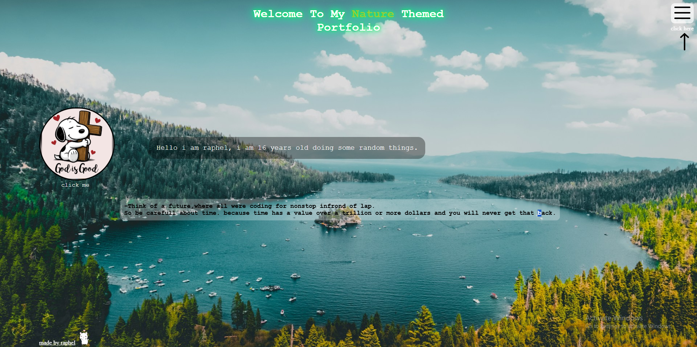
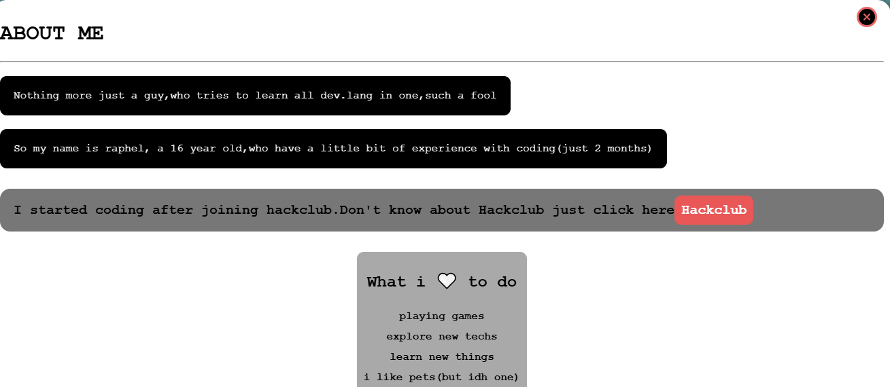
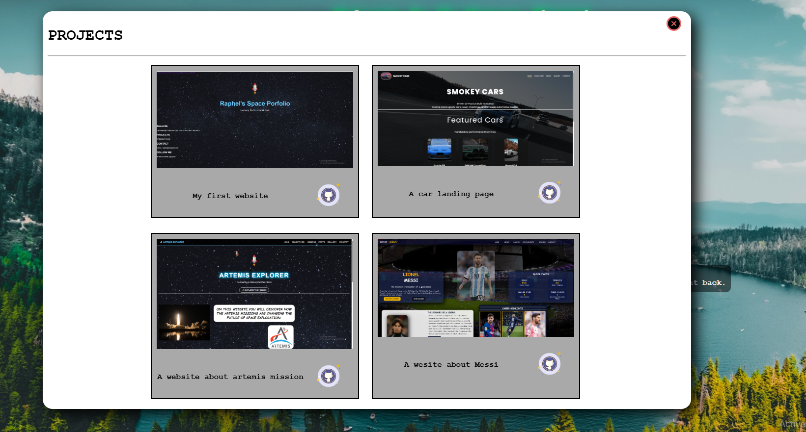
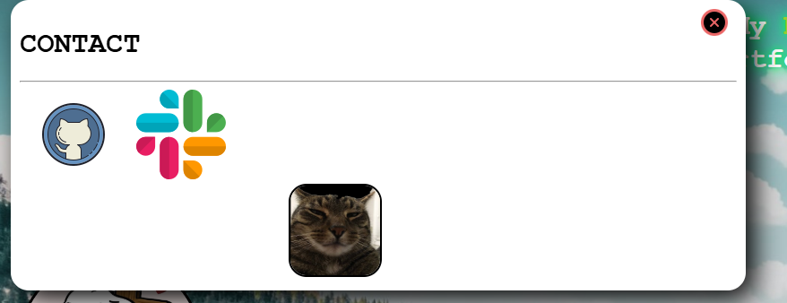
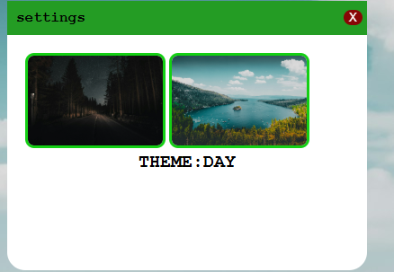

# WildPortfolio

This is my first website using js i am so happy to use it well in this website
It is a simple nature themed portfolio which is super responsive and interactive.
It includes my coding way,projects,contact etc.... Its main highlight is the the nature theme.If you like it give it a star.It is very proud to complete this project 

## Live Demo

[Open the live website](https://raphelreji.github.io/personal-website-raphel/)

## Screenshots

## Features

- A nature themed portfolio
- used javascript to make it responsive 
- a unique nav bar
- changable background
- click the profile picture to view my tech stacks
- you can change settings in the menu
- cool hover animation in the heading
- click the github icon in projects to view my projects
- click the icons in the contact to contact me

## Built With

- HTML
- CSS
- javascript
  
### How It Works

You can explore my portfolio through many section.you can change the settings by go to menu and other pages like a software window.

## Design
A nature blended theme is selected for my portfolio

## What I Learned

- Lot of html,css and mainly js concepts as a beginner
- learned the basics of how javascript works

## Credits

- Images and assets: copyright belong to the rightful owner.
- Icons are taken from icon8.

## License

This project was created  under MIT-do what ever with it.

